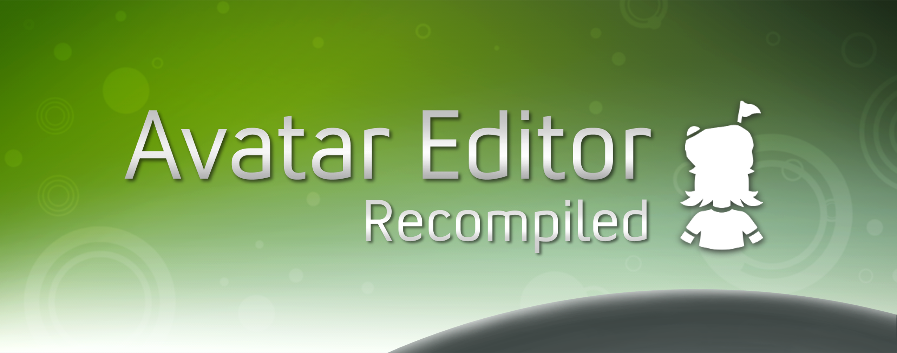

  

# Avatar Editor Recomp

An unofficial PC port of the Fall 2010 Kinect-preview Avatar Editor created through static recompilation using the [ReXGlue SDK](https://github.com/rexglue/rexglue-sdk).

This project doesn't include the Avatar Editor or assets. You must provide a copy of the Avatar Editor and assets.

## Features

**Search**  
Press `Ctrl+F` to search avatar item catalogs and styles.

**Native rendering**  
Renders through a native D3D12 renderer.

**Input**  
XInput controller and keyboard support.

**Fullscreen toggle**  
Press `F11` to toggle between window and fullscreen modes.

## Building

See [BUILDING.md](BUILDING.md). 

## Config

The config file `avatareditor.toml` is expected to be in the build's root folder.

The asset and closet directories can be set in the config. 

Saves and profile data live in `%USERPROFILE%\JMstudios`

- `avatar\manifest\avatar_manifest.bin`, the saved avatar
- `avatar\manifest\gamerpic.png`, the AE gamer pic 
- `user.toml`, set gamertag and path to gamer pic

## Credits

- [ReXGlue SDK](https://github.com/rexglue/rexglue-sdk)
- [Xenia](https://xenia.jp) 
- [UnleashedRecomp](https://github.com/hedge-dev/UnleashedRecomp)
- [XenosRecomp](https://github.com/hedge-dev/XenosRecomp)
- [plume](https://github.com/renderbag/plume)

Special thanks to [Sherlyn](https://x.com/sherlyn_marsh) for the original artwork. 

Disclaimer: This project was developed using LLM tools.

